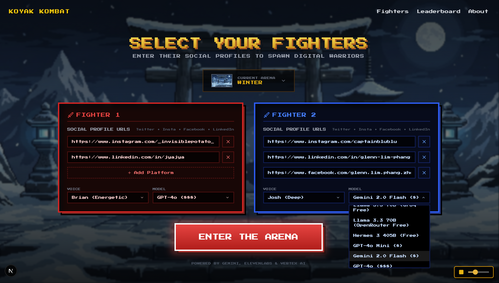

🎮 Koyak Kombat
Generative AI Roast-Battle Arcade

  
 
   

✨ Overview

Koyak Kombat transforms any social media profile into a fully autonomous AI fighter.
It scrapes a user’s online presence, builds a Digital Twin, and lets these personas battle in real time using AI-generated roasts, dynamic animations, voice synthesis, and an independent AI judge.

A streamlined interface, arcade-style design, and a fast battle loop make it feel like a modern AI game.

🌟 Features

Digital Twin Persona Modeling
Convert social URLs (Twitter / Instagram / LinkedIn / Facebook) into AI fighters.

AI Roast Engine
Powered by GPT-4o, Gemini, Claude, and Llama 3 via OpenRouter & Groq.

Autonomous Battle System
Streaming roasts, timing-based damage boosts, round control, animations.

Independent AI Judge
Evaluates roasts for specificity, creativity, and accuracy.

Voice Synthesis (Local only)
ElevenLabs voices for both fighters.

Finishing Move System
Sketch → interpreted by AI → rendered into a cinematic video using Veo 3.

Arcade UI
CRT effects, pixel sprites, animated environments.

🖼️ Screenshots

     

🧱 Tech Stack

Frontend

Next.js, React, Tailwind, Framer Motion

tldraw, Shadcn UI

Backend

FastAPI, Pydantic, Uvicorn

AI / APIs

OpenRouter (GPT-4o / Gemini / Claude / Llama)

Groq (Llama 3)

ElevenLabs (TTS)

SocialData (Twitter scraping)

Apify (Instagram / LinkedIn / Facebook)

Vertex AI (Veo 3 video generation)

🏁 Getting Started
Prerequisites

Node.js 18+

Python 3.10+
