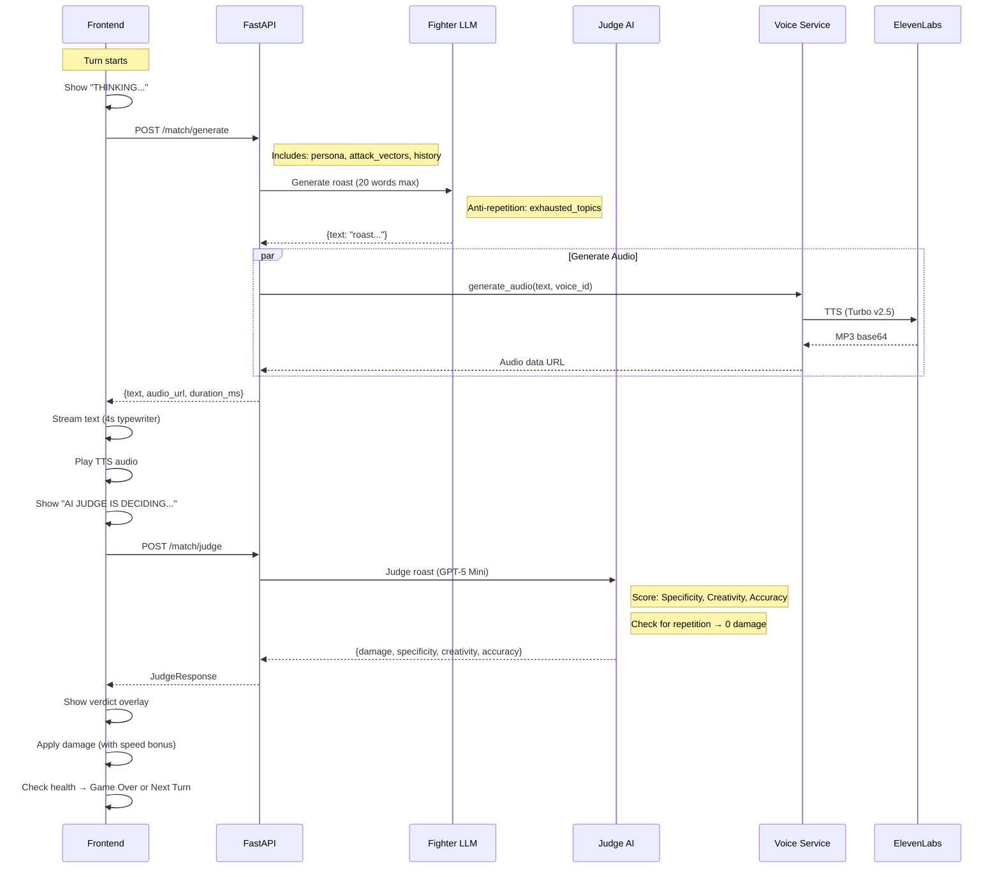
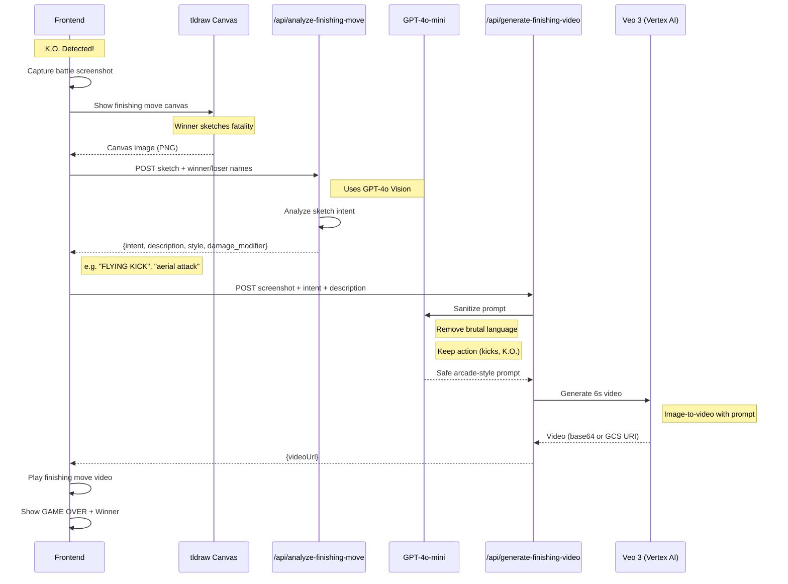

# 🔥 Koyak Kombat

> **The world's first generative AI roast battle arcade.**


---

## 🎮 What is Koyak Kombat?

**Ever wanted to see what happens when two people's digital personas battle it out?** Koyak Kombat turns social profiles into AI fighters that roast each other based on real personality quirks, career choices, and online behavior. It's the most entertaining way to discover fun facts about people: their hidden insecurities, quirky habits, and digital footprints, all through an arcade-style roast battle.

**How it works:** Paste any social media URL (Twitter, Instagram, LinkedIn, Facebook). The AI scrapes their profile, learns their personality, and spawns a Digital Twin that thinks, speaks, and roasts exactly like them. Then watch them go at it: fully autonomous, brutally personal, and surprisingly accurate.

<p align="center">
  
</p>

### The Experience

1. **Spawn Your Fighters:** Paste up to 3 social media URLs per fighter. The AI scrapes, analyzes, and generates persona-accurate Digital Twins.
2. **Choose Your Weapon:** Select AI models (GPT-4o, Gemini, Llama, Claude) and voice presets for each fighter.
3. **Select Your Arena:** Pick from 6 themed battle backgrounds.
4. **Watch the Carnage:** The match erupts into real-time verbal warfare with streaming roasts, TTS audio, and an independent AI Judge scoring damage.
5. **Draw Your Fatality:** The winner sketches a finishing move, analyzed by AI and rendered into video.

<p align="center">
  
</p>

<p align="center">
  
</p>

---

## 🌐 Live Deployment

**Frontend**: [koyak-kombat.vercel.app](https://koyak-kombat.vercel.app)  
**Backend**: [koyak-kombat-backend.onrender.com](https://koyak-kombat-backend.onrender.com)

### Known Limitations

| Limitation | Impact |
| :--- | :--- |
| **Voice Synthesis** ❌ | ElevenLabs disabled (free tier abuse detection due to calling it from deployed instance e.g. Vercel). Battles run without audio. |
| **Finishing Move Canvas** ⚠️ | tldraw requires license for deployment. Only works when run locally|
| **Cold Start Delay** ⚠️ | Render free tier spins down. First request takes ~50 seconds. |
| **Performance** ⚠️ | Free instance cannot handle multiple concurrent users. Slow under load. |

---

## 🚀 Features

| Feature | Status |
| :--- | :---: |
| **Digital Twin Generation** (Multi-platform persona synthesis) | ✅ |
| **Multi-Platform Scraping** (Twitter, Instagram, LinkedIn, Facebook) | ✅ |
| **AI-Powered Roasts** (OpenRouter + Groq: Gemini, GPT-4o, Llama, Claude) | ✅ |
| **Independent AI Judge** (GPT-5 Mini scoring with anti-repetition) | ✅ |
| **ElevenLabs TTS** (7 voice presets with real-time audio) | ✅ |
| **Retro Arcade Aesthetic** (CRT effects, pixel art, animations) | ✅ |
| **Performance Stats** (Real-time latency & generation time) | ✅ |
| **Speed Bonus System** (Fast roasts deal more damage) | ✅ |
| **Round System** (Roulette animation, "X STARTS!" indicator) | ✅ |
| **KO Visuals** (Skull icon, health bar depletion) | ✅ |
| **Background Music** (Phase-aware BGM with dynamic volume) | ✅ |
| **Arena Selection** (6 themed battle backgrounds) | ✅ |
| **Finishing Move Canvas** (tldraw integration) | ✅ |
| **AI Drawing Analysis** (Intent detection from sketches) | ✅ |
| **Battle Screenshot Capture** (For video generation) | ✅ |
| **Batch Fighter Creation** (Parallel scraping for both fighters) | ✅ |
| **Finishing Move Video** (Veo 3 generation) | ✅ |

---

## 🛠️ Tech Stack

| Layer | Technology |
| :--- | :--- |
| **Frontend** | Next.js, React, Tailwind CSS, Framer Motion, tldraw |
| **Backend** | FastAPI (Python), Pydantic |
| **AI/LLM** | OpenRouter (GPT-4o, Gemini, Claude, Llama), Groq (Llama 3) |
| **AI Judge** | GPT-5 Mini via OpenRouter |
| **Scraping** | SocialData.tools (Twitter), Apify (Instagram, LinkedIn, Facebook) |
| **Voice** | ElevenLabs (7 voice presets, Turbo v2.5) |
| **Video** | Google Vertex AI / Veo 3 |
| **Queue** | Redis (RQ) *(Planned)* |
| **UI Components** | Shadcn UI, Lucide Icons |

---

## 🏁 Getting Started

### Prerequisites

* Node.js 18+
* Python 3.10+

---

### Local Development

#### 1. Clone & Install

```bash
git clone https://github.com/yourusername/koyak-kombat.git
cd koyak-kombat

# Frontend
npm install

# Backend
cd backend
python -m venv venv
source venv/bin/activate
pip install -r requirements.txt
```

#### 2. Configure Environment

**Frontend** (root `.env.local`):
```env
OPENROUTER_API_KEY=sk-or-...
GOOGLE_CREDENTIALS_JSON={"type":"service_account",...}  # Optional, for video gen
```

**Backend** (`backend/.env.local`):
```env
# Required for AI model inference
OPENROUTER_API_KEY=sk-or-...

# Optional: For Groq-hosted models (Llama)
GROQ_API_KEY=gsk_...

# Required for Twitter scraping
SOCIALDATA_API_KEY=your_socialdata_key

# Required for Instagram, LinkedIn, Facebook scraping
APIFY_API_TOKEN=apify_api_...

# Required for voice synthesis
ELEVENLABS_API_KEY=sk_...

# Required for video generation (Veo 3)
VERTEX_AI_PROJECT=your-gcp-project
VERTEX_AI_LOCATION=us-central1
GOOGLE_APPLICATION_CREDENTIALS=path/to/vertex-ai-key.json
```

#### 3. Run Locally

```bash
# Terminal 1: Backend API
cd backend
source venv/bin/activate
python -m uvicorn main:app --reload --port 8000

# Terminal 2: Frontend
npm run dev
```

Open [http://localhost:3000](http://localhost:3000) and enter the arena!

---

### 🚀 Production Deployment

#### Frontend → Vercel

1. Push your repo to GitHub
2. Go to [vercel.com/new](https://vercel.com/new) → Import your repo
3. Add environment variables:
   | Key | Value |
   |-----|-------|
   | `OPENROUTER_API_KEY` | Your OpenRouter API key |
   | `GOOGLE_CREDENTIALS_JSON` | Your `vertex-ai-key.json` as single-line JSON |
   | `NEXT_PUBLIC_API_URL` | Your backend URL (add after backend deploys) |
4. Deploy!

#### Backend → Render

1. Go to [render.com](https://render.com) → New Web Service
2. Connect your GitHub repo
3. Configure:
   | Setting | Value |
   |---------|-------|
   | **Root Directory** | `backend` |
   | **Build Command** | `pip install -r requirements.txt` |
   | **Start Command** | `uvicorn main:app --host 0.0.0.0 --port $PORT` |
4. Add environment variables:
   | Key | Required For |
   |-----|--------------|
   | `OPENROUTER_API_KEY` | AI roast generation |
   | `ELEVENLABS_API_KEY` | Voice synthesis |
   | `APIFY_API_TOKEN` | Instagram, LinkedIn, Facebook scraping |
   | `GROQ_API_KEY` | Groq-hosted models (Llama) |
   | `SOCIALDATA_API_KEY` | Twitter/X scraping |
5. Deploy and copy your URL (e.g., `https://your-app.onrender.com`)
6. Go back to Vercel → Add `NEXT_PUBLIC_API_URL=https://your-app.onrender.com/api/v1`
7. Redeploy Vercel

> ⚠️ **Note**: First request after inactivity will take ~50 seconds (Render free tier spin-up). After that, it'll be fast.

---

## 🔄 How It Works

The battle system orchestrates multiple AI services in real-time to create dynamic, personalized roasts:



### Finishing Move Sequence

When a fighter's health reaches 0, the winner gets to draw a finishing move:



---

## 🎮 Gameplay Mechanics

### Damage System

Each roast is scored by an independent AI Judge on three criteria:

| Criterion | Weight | Description |
| :--- | :---: | :--- |
| **Specificity** | 30% | How personal is the attack? Generic = low damage |
| **Creativity** | 30% | Unique burns hit harder than clichés |
| **Accuracy** | 40% | Roasts based on real profile content deal extra damage |

**Formula:** 

1. Judge AI calculates weighted score: `(Specificity × 0.3) + (Creativity × 0.3) + (Accuracy × 0.4)` = Base Score (0-100)
2. Base Damage = `Base Score × 0.6` (scales to max 60 damage per turn)
3. Final Damage = `Base Damage × Speed Multiplier`

### Speed Bonuses

Response time affects damage output:

| Response Time | Modifier |
| :--- | :---: |
| < 2 seconds | +15% |
| < 3 seconds | +10% |
| > 5 seconds | -10% |

### Anti-Repetition System

The Judge AI detects repeated topics and penalizes recycled attacks:
- Topic categorization (appearance, career, dating, etc.)
- Exhausted topics tracked across turns
- Repetition = 0 damage

---

## 📁 Project Structure

```
koyak-kombat/
├── pages/                    # Next.js pages
│   ├── index.js              # Landing page
│   ├── character.js          # Fighter selection & spawning
│   ├── battle.js             # Main battle arena
│   └── about.js              # About page
├── components/
│   ├── FinishingMoveDrawer.js # tldraw canvas for fatality
│   └── ui/                   # Shadcn UI components
├── lib/
│   └── api.js                # Frontend API client
├── backend/
│   ├── main.py               # FastAPI routes
│   ├── services.py           # Scraping, LLM, Voice, Judge services
│   ├── profiler.py           # Persona synthesis & aggregation
│   ├── platform_router.py    # URL → Platform routing
│   └── worker.py             # Redis background jobs
├── public/
│   ├── backgrounds/          # 6 battle arenas
│   ├── characters/           # Fighter sprites (male/female)
│   └── music/                # BGM tracks
└── styles/
    └── globals.css           # Tailwind + custom styles
```

---

## 🤝 Contributing

Pull requests are welcome! For major changes, please open an issue first.

---

## 📜 License

MIT License. See [LICENSE](LICENSE) for details.

---

<p align="center">
  <b>Built with 🔥 and AI. No feelings were spared.</b>
</p>
# koyoki-

