# 🔧 Technical Documentation

> Architecture and flow diagrams for Koyak Kombat

---

## 📐 System Architecture

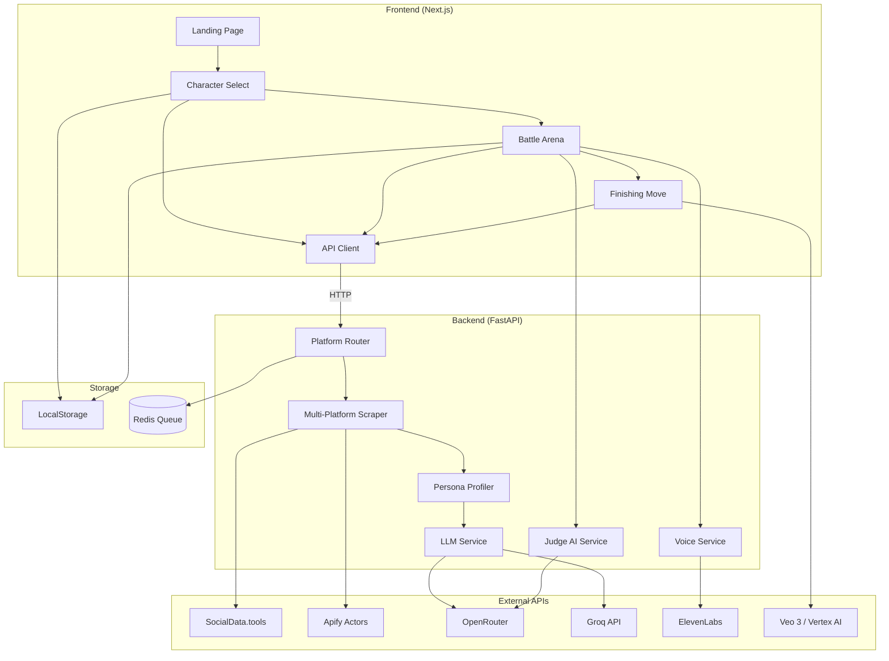

---

## 🎮 User Flow

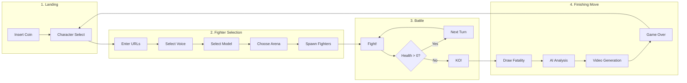

---

## 🤖 Fighter Creation Flow

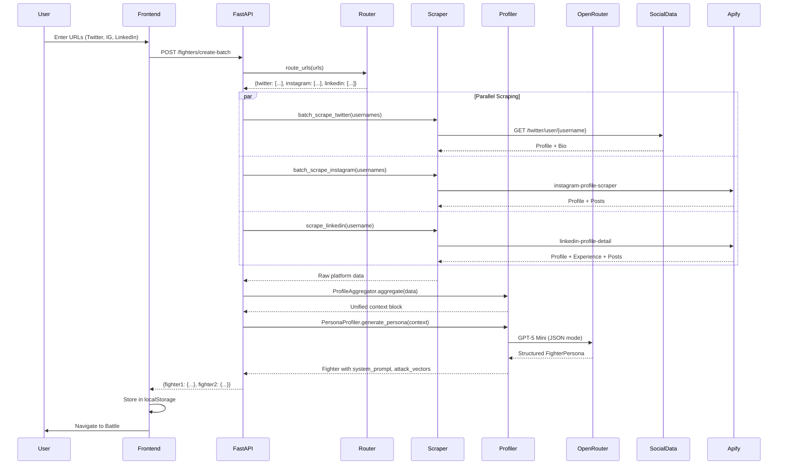

---

## ⚔️ Battle Turn Flow

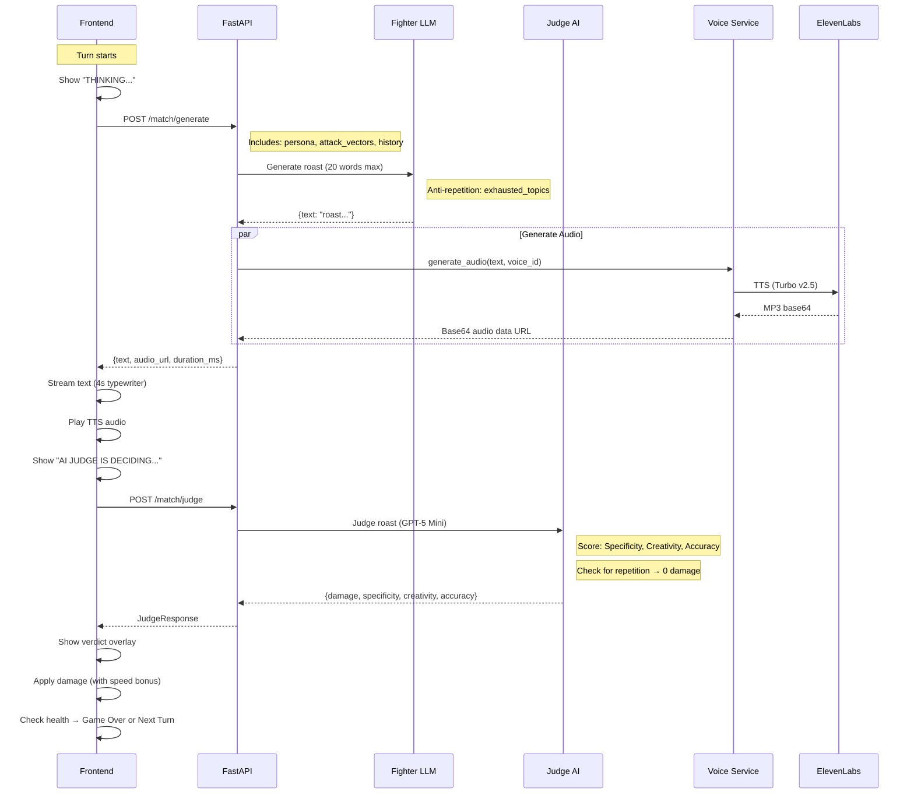

---

## 🏗️ Component Architecture

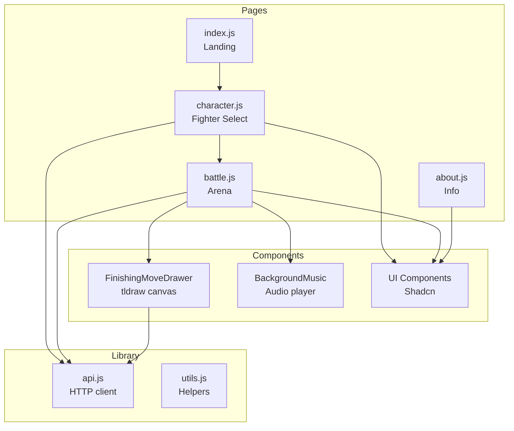

---

## 🔌 Backend Services

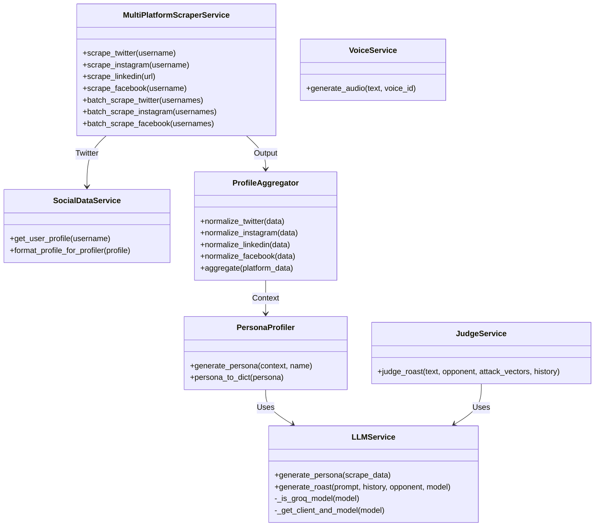

---

## 📊 Data Models

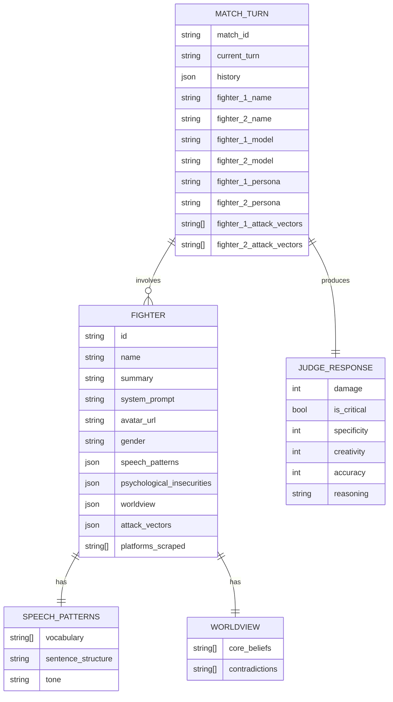

---

## 🎯 Damage Calculation

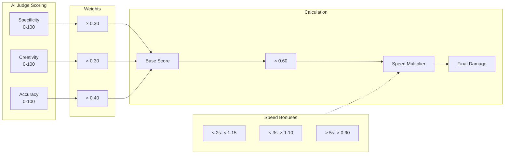

---

## 🔄 Anti-Repetition System

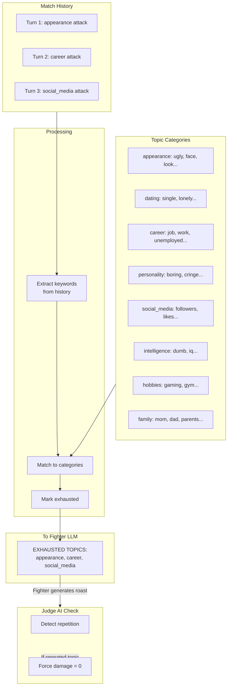

---

## 🎬 Finishing Move Flow

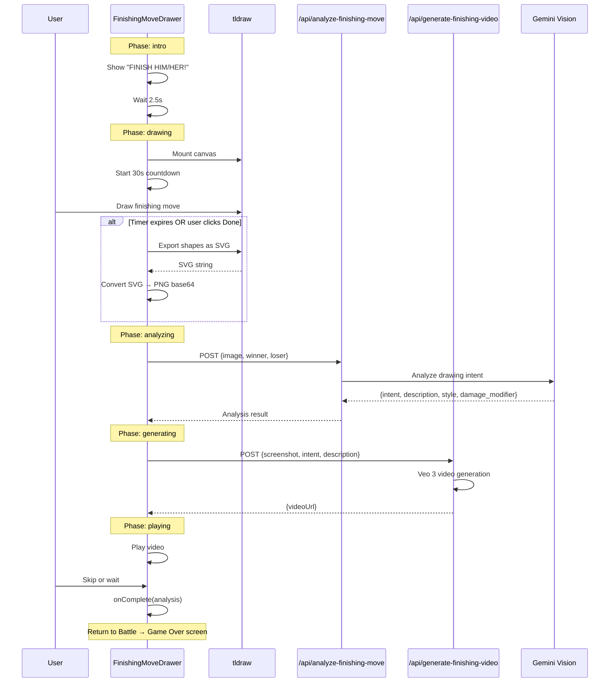

---

## 🌐 API Endpoints

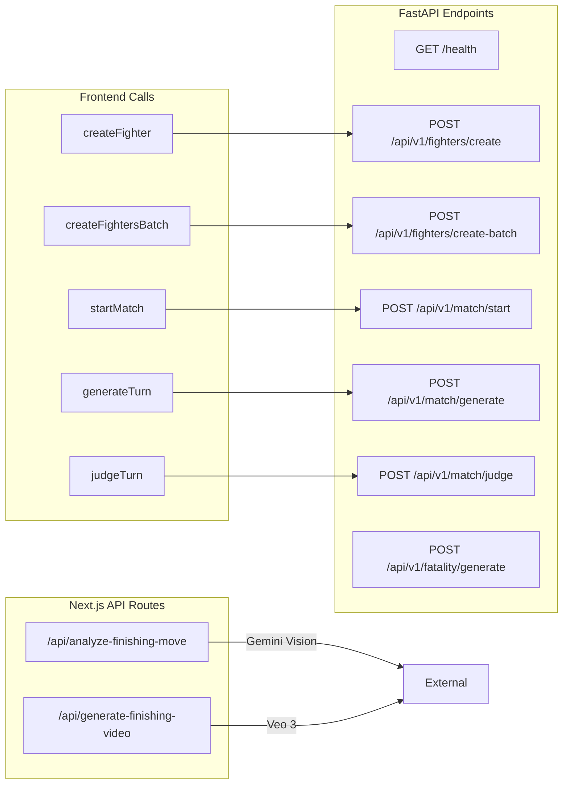

---

## 🔊 Voice System

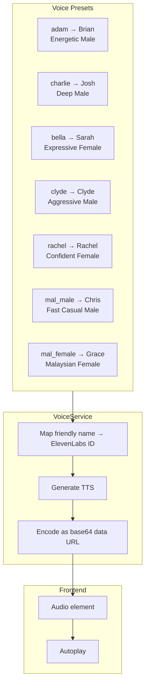

---

## 📦 External Dependencies

| Service | Purpose | API Type |
|---------|---------|----------|
| **SocialData.tools** | Twitter profile scraping | REST API |
| **Apify** | Instagram, LinkedIn, Facebook scraping | Actor API |
| **OpenRouter** | GPT-4o, Gemini, Claude routing | OpenAI-compatible |
| **Groq** | Fast Llama inference | OpenAI-compatible |
| **ElevenLabs** | Text-to-Speech | REST API |
| **Vertex AI / Veo 3** | Finishing move video generation | Google Cloud |

---

## 🔐 Environment Variables

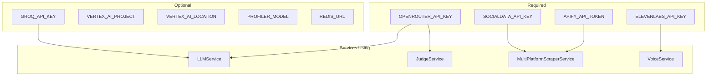

---

  <b>Built with 🔥 and AI</b>

